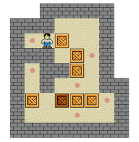
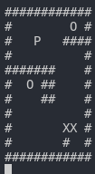

# 
 my_sokoban 

  

    <i>Sokoban (warehouse keeper in Japanese) is a type of transport puzzle, in which  
    the player pushes boxes or crates around in a warehouse, trying to get them to  
    storage locations. The puzzle is usually implemented as a video game.  
    Sokoban was created in 1981 by Hiroyuki Imabayashi, and published in 1982 by  
    Thinking Rabbit, a software house based in Takarazuka, Japan.    
    The game is played on a board of squares, where each square is a floor or  
    a wall. Some floor squares contain boxes, and some floor squares are marked as  
    storage locations. The player is confined to the board, and may move  
    horizontally or vertically onto empty squares (never through walls or boxes).  
    The player can also move into a box, which pushes it into the square beyond.  
    Boxes may not be pushed into other boxes or walls, and they cannot be pulled.  
    The puzzle is solved when all boxes are at storage locations.     </i>

The Goal of the project is to develop a copy of this game in terminal mode using ncurses library.  
map file representing the warehouse map, containing '#' for walls, 
‘P’ for the player, ‘X’ for boxes and ‘O’ for storage locations.  
To move the 'P' you must use the arrows 'KEY_UP', 'KEY_DOWN', 'KEY_LEFT'
and 'KEY_RIGHT'. To quit the game you must finish the map or press the 'esc' key.  

# 
 Exemple Map 

  